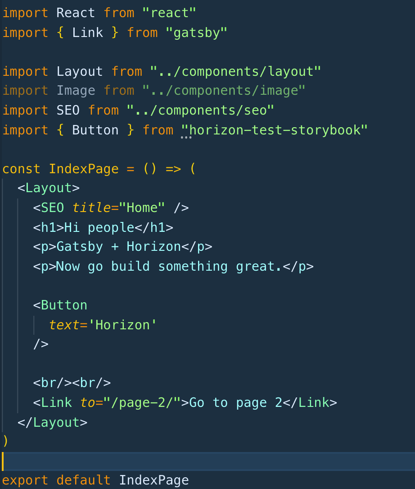

## Introduction
This is a component library designed to be imported into any React / Gatsby based project. The components have been developed in StoryBook which can be run from the project. 

### Dependancies
The component library's main dependancies are React and <a href='https://emotion.sh/docs/introduction'>Emotion</a>. These will be added during installation if they don't already exist in your project.

## How to use this repo
1. You develop and maintain your components here
2. Build out a static version of StoryBook and host appropratley for all stakeholders to have access to.
3. Build the components for distribution, to be used by the organisation in developing web applications.

## Available Scripts

In the project directory, you can run:

### `yarn start`

Runs storybook in development

### `yarn test`

Runs react test scripts

### `yarn build`

Builds out the components to the package `/dist` folder

### `yarn build-storybook`

Build a static version of story book in `storybook-static`

## Get Started

1. Install as a dependancy to your React or Gatsby project - `yarn add horizon-test-storybook`
2. If using Gatsby, be sure to include the <a href="https://www.gatsbyjs.org/docs/emotion/">Gatsby Emotion Plugin</a>
3. Import components to be utilised and start building.

### Gatsby Example:  

## That's All Folks!